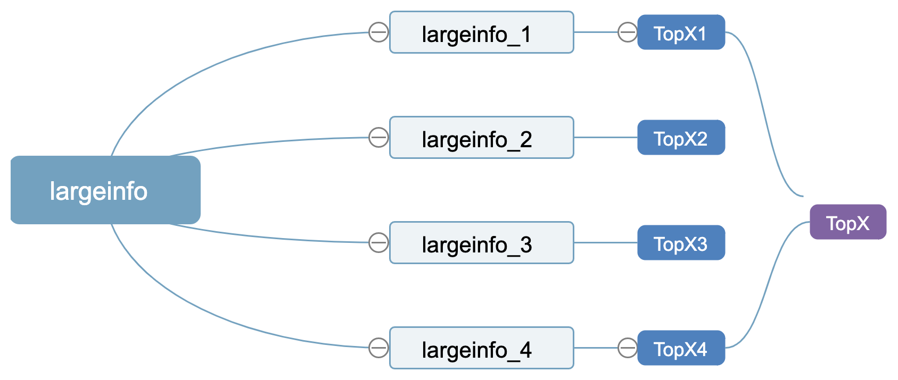
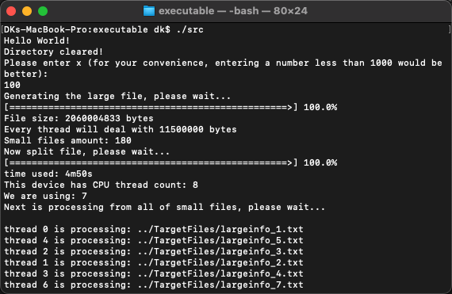
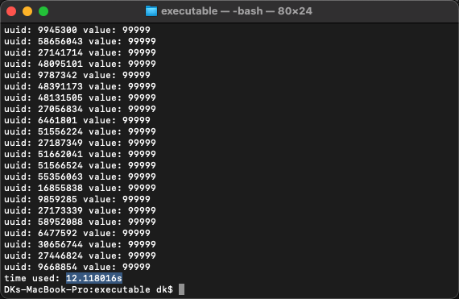

# LargestX problem

Find X-largest values in a file, and it could be a large file.

## Basic Information

Each line in the file contains an uuid and a value.

Example:
```
1426828011 9 
1426828028 350
1426828037 25
1426828056 231
1426828058 109
1426828066 111
```

## How do we do that

### Top-X

We need a heap to hold all of these x elements. Since the final result we need is UUID but the comparisons happen among values, we should build a struct to contain them all. C++ stand library doesn’t contain heap data structure, so we need write one.

Min-heap is a good idea because we can easy to say if the upcoming one is qualified to enter the heap through a comparison between the top one from the heap and the upcoming one.

If the upcoming one is bigger than the top one, we replace the top one and make MaxDownHeap, then we can still have a min-heap but keep the size of min-heap to X.

So the time complexity and space complexity depends on the size of the heap.

| Complexity | Value    |
|------------|----------|
| Time       | O(NlogX) |
| Space      | O(X)     |


### What's the normal thinking

If we want to get TopX from a small file, we have 2 ways to do. 
1. Read all buffer in memory then deal with it. 
2. Read line by line, then deal with a single line until we read them all. Actually both of them are fine since the file is small. But think about that we have a large file like 1GB but with 500M memory. There are also 2 ways to handle the large file


### How about a large file

There are also 2 ways to handle the large file

1. We fully use our memory. Since our memory is smaller than the file, we read partial data from the file into the memory, which matches the size of our available memory. After that we deal with that data to get topx, we hold that topx result, then go to the remaining part of data, if they still are larger than the memory, we split it to memory size again. We keep doing these until we finish the large file, maybe we will get more than one topx, then we combine those topx to get our final result. 

2. We fully use our cpu. We assume that one cpu can handle n lines of data at a time so that it’s not too heavy for it and we can have m cpus work simultaneously, which means we should split our large file to many small files in advance and each one is n lines. Then we use m cpus to deal with those small files, maybe the amount of small files is more than m, it’s fine, every cpu will keep going until all small files are dealt with. 

So I chose the second one. Assume one cpu can handle <i>l=1,000,000</i> lines at a time, for a total L lines file, we can split it into f=ceil(L/l) files. If we have 12 cpu units, all cpu can handle <i>12*1,000,000</i> lines at one turn. In this circumstance, we need ceil(f/12) turns to complete the mission.

### How does it work

We define an uuid 16 digits long, which means it can support 10<sup>16</sup> uuids and a value 5 digits long. So one line has at most 16+1+5=22 bytes, but we have ‘\r’ to start a new line, so we have 23 bytes a line in Linux/Mac and 24 bytes in Windows(\r\n).

If a large file is 1Gb, then we can have a rough calculation of lines that <i>1*1024*1024*1024/24=44739242</i>. It’s a good idea that we let every single thread read from the start of a line in the file but since we don’t know actual length of each line, we cannot move every thread into the beginning of lines correctly. So I decide to split a large file into n small chunks, and the first n-1 chunks have the same lines and the remaining would be written into the nth chunk. 

Each thread will maintain a TopX min-heap, after all threads finish their work, we combine those TopX to get a final TopX. 

See the following figure.



I will simulate the file generation using positive number in order for uuid and random the value for each uuid.

### Let's do the math

Let’s say we are going to use 12 threads to proceed those chunks and each thread can deal with 1000000 lines at a time. So we can calculate how many files we should split into. <i>24*1000000=24000000</i> bytes which is the small file’s size.  <i>44739242/1000000=44.7</i> files, so we will make 45 files and 12 threads will take 4 times to finish it (12+12+12+9).

See the following:

`a cpu deal = 1000000 line`

`FileLines = FileSize / LineLength`

`FileCount = FileLines / a cpu deal`

`Turns = FileCount / cpus`


e.g. we have 1 GB of the large file, and we have 12 cpus.

`a cpu deal = 1000000 line`

`FileLines = 1*1024*1024*1024 / 24(MacOS 23)=44739242`

`FileCount = 44739242 / 1000000=ceil(44.7)=45`

`Turns = 45 / 12=ceil(3.75)=4`

## How to run

Since I used C++20 and C++ compilers are various depends on the platform, so I choose to pre-built for Windows and MacOS then you can directly run the executable file. In Windows it's MSBuild and clang for MacOS. And the codes from different platforms will be seperate to different folders because they don't have unified features.

All the executable program are in the executable folder.

Notice: In MacOS, running an exec maybe blocked by system, please make sure to allow it in pravicy setting.

There are few ways to test the program, go to "executable" directory and go to platform respectively:

<b>Windows: </b> 
1. Run the batch files respectively for each test case.
2. Use windows shell or prompt, then cd to target directory, then input the following(depend on you windows version)

#Windows 10 or older:
```shell
src.exe
src.exe unittest 1
src.exe unittest 2
```
#Windows 11:
```shell
.\src.exe
.\src.exe unittest 1
.\src.exe unittest 2
```

<b>MacOS: </b> 
```shell
./src
./src unittest 1
./src unittest 2
```

The argument "unittest" is used for a small file unit test, and the "1" is for a 2MB small file and the "2" is for a 2 lines file.

If you don't put any argument, it will test a 2GB large file.

Then you will be asked to enter a number x which mean TopX.

Every txt file will be stored in TargetFiles, <b>Please make sure you have at least 5GB space on the disk.</b> 

## How to build

<em>If you still want to build:

1. In windows, make sure you have VS2019 or above and enable C++20 standard, then build with VS2019.

2. In MacOS, just open Project in CLion and build, also make sure your C++ compiler in MacOS supports C++20 and if you are in arm64 platform remember to designate arch to arm64.

3. In MacOS, if you have g++, then go to the directory where "MakeFile" stay, then just:
```shell
make all
```
After this, executable file would be add to a new directory "Build", then go inside "Build", use terminal or prompt to execute the command mentioned in #How to run# section.

<b>Again: Make sure your compiler supports C++20 already and if the compiler should work in arm64, also make sure your compiler supports arm64 architecture. I recommend g++-12.</b> 

</em>

## What does the running look like

The big part is large file part, let's see. The program will generate a large file and then get the top x elements of the large file then output the result.

I will keep tracking every part time consuming. <b>For your convenience, entering a number less than 1000 would be better, or the output would be too much.</b> 

When everything is done, you can get the result and statistics.



## How about performance
On my laptop, I write and split a large file which is 2GB. Make X=100, use 6 cpu thread, then I get:


| Step            | Time   |
|-----------------|--------|
| Generate 2GB and Split 180 Files | 4m50s |
| Read 180 files and get TopX  | 12.118s |

My laptop system information:
* OS: macOS 12.5.1 (21G83)
* Arch: arm64
* CPU: Apple M1 Pro
* Memory: 32 GB

## What next
Due to limited time, there are still a lot of optimization and test work can be done such as memory detect, both fully use memory and cpu threads, hard disk enough space check, etc. I will try my best to update this project on my local.